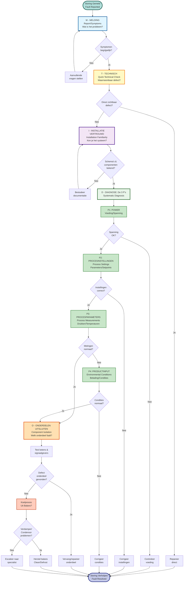
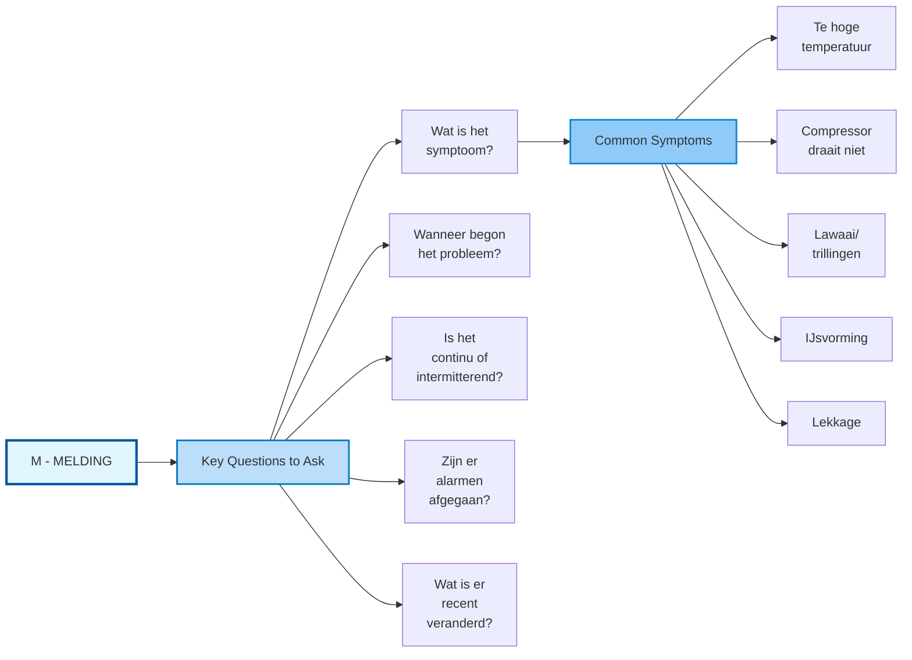
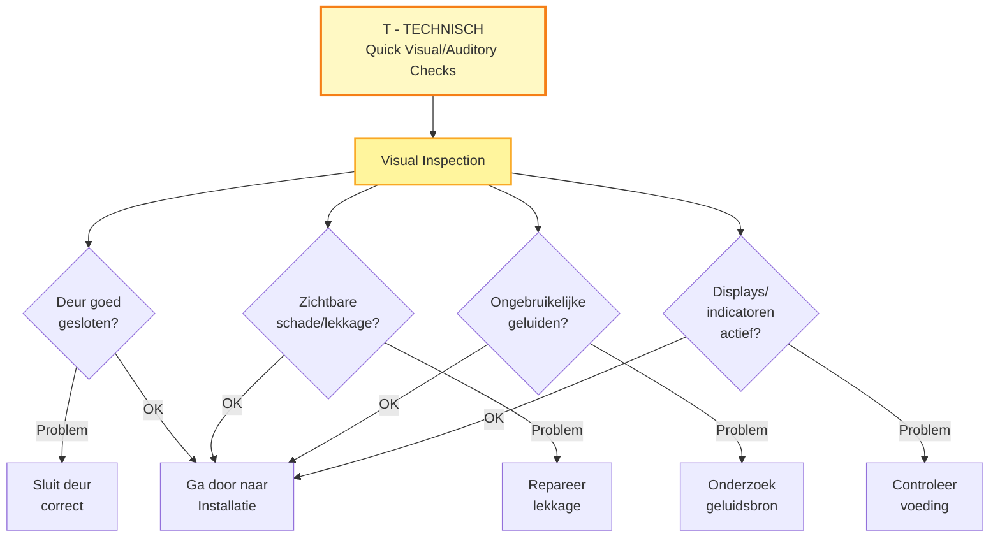
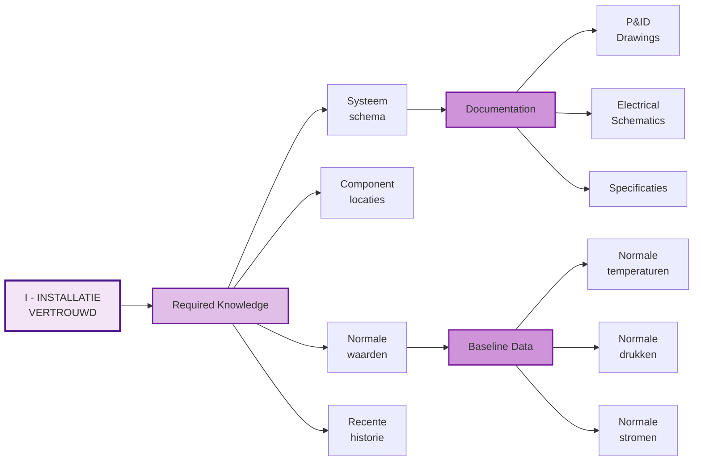
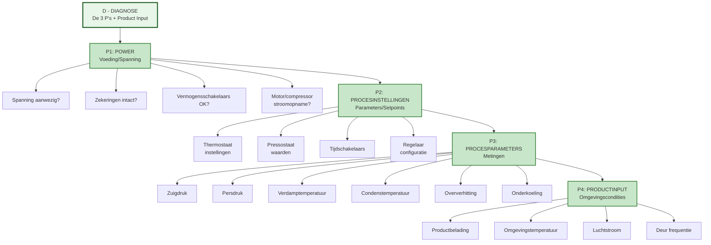
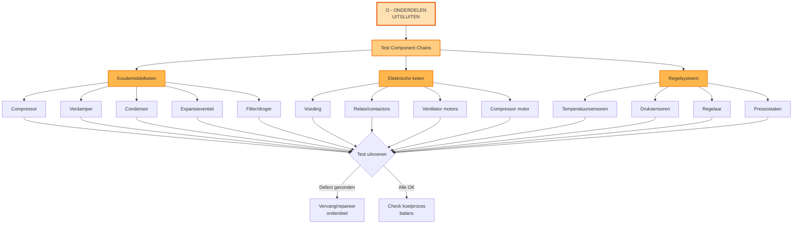
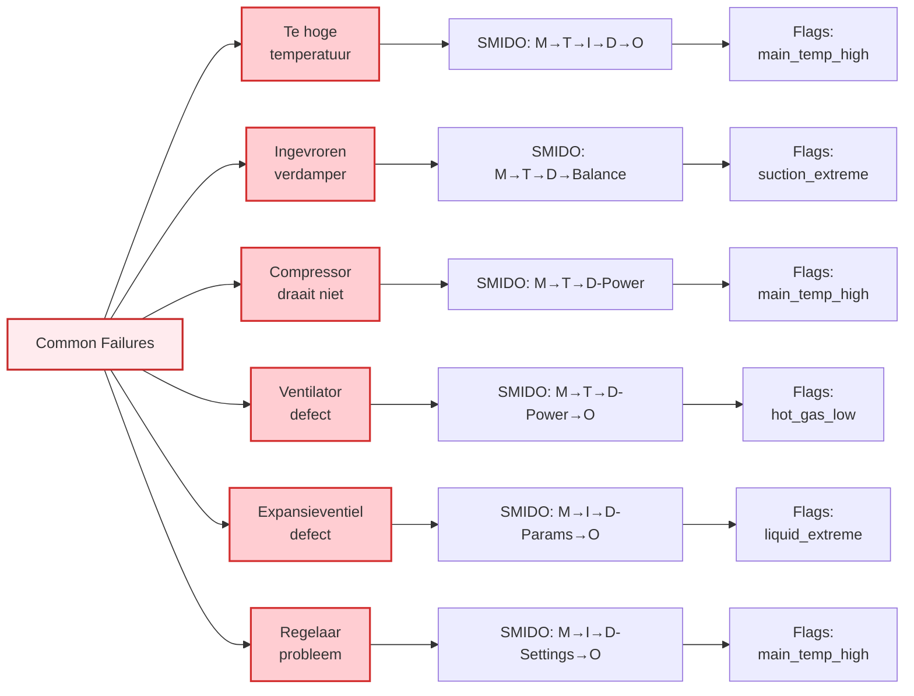
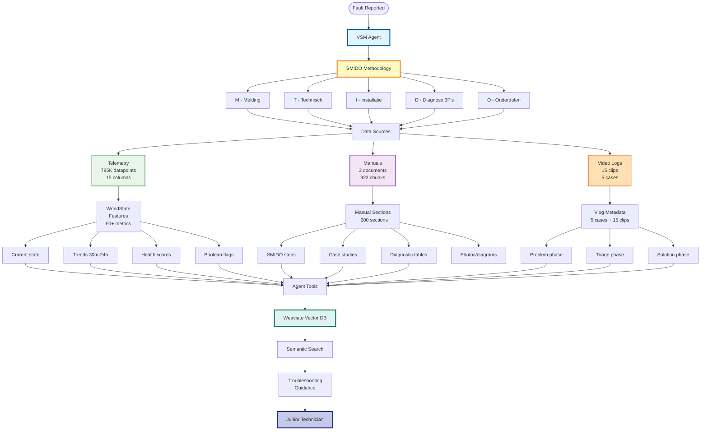
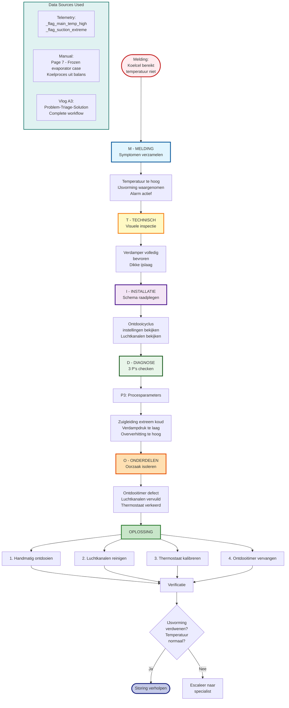
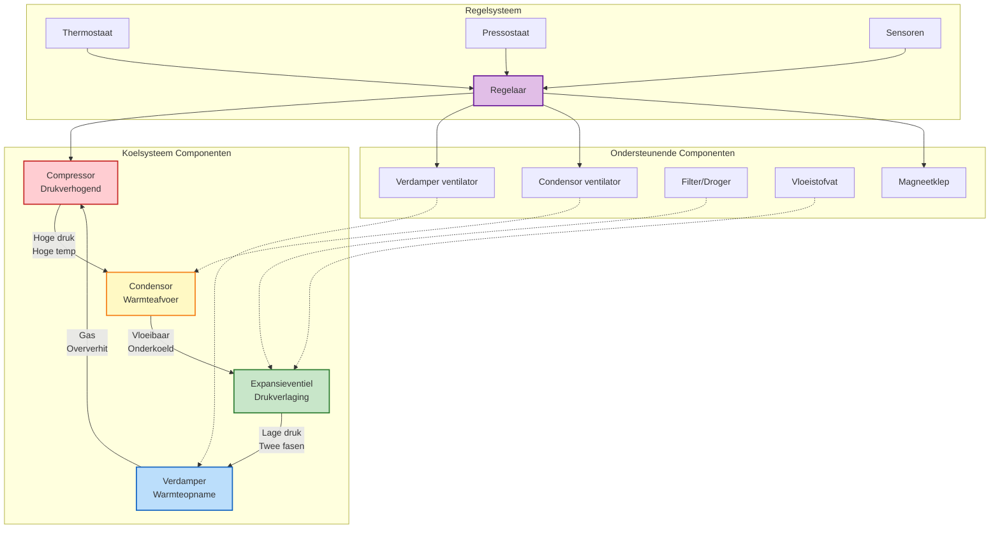

# SMIDO Methodology - Visual Diagrams

This document contains mermaid diagrams illustrating the SMIDO troubleshooting methodology for cooling systems.

---

## 1. SMIDO Overview Flowchart

The main SMIDO troubleshooting workflow:

---

## 2. SMIDO Detailed Breakdown

### 2.1 Melding (M) - Report Phase

### 2.2 Technisch (T) - Quick Technical Check

### 2.3 Installatie Vertrouwd (I) - Familiarity Check

### 2.4 Diagnose (D) - The 3 P's (+ Product Input)

### 2.5 Onderdelen Uitsluiten (O) - Component Isolation

---

## 3. Common Failure Modes Mapped to SMIDO

---

## 4. SMIDO + Data Sources Integration

---

## 5. Example: Frozen Evaporator Troubleshooting Flow

---

## 6. Component Reference Diagram

---

## Legend

| Color | SMIDO Phase |
|-------|-------------|
| 🔵 Blue | M - Melding (Report) |
| 🟡 Yellow | T - Technisch (Technical Quick Check) |
| 🟣 Purple | I - Installatie Vertrouwd (Familiarity) |
| 🟢 Green | D - Diagnose (3 P's + Product Input) |
| 🟠 Orange | O - Onderdelen Uitsluiten (Component Isolation) |
| 🔴 Red | Failure Modes / Problems |
| 🔵 Indigo | Resolution / End State |
| 🟢 Teal | Data Sources / Tools |

