# SMIDO Methodology - Visual Diagrams

This document contains mermaid diagrams illustrating the SMIDO troubleshooting methodology for cooling systems.

---

## 1. SMIDO Overview Flowchart

The main SMIDO troubleshooting workflow:

---

## 2. SMIDO Detailed Breakdown

### 2.1 Melding (M) - Report Phase

### 2.2 Technisch (T) - Quick Technical Check

### 2.3 Installatie Vertrouwd (I) - Familiarity Check

### 2.4 Diagnose (D) - The 3 P's (+ Product Input)

### 2.5 Onderdelen Uitsluiten (O) - Component Isolation

---

## 3. Common Failure Modes Mapped to SMIDO

```mermaid
flowchart LR
    Failures[Common Failures] --> F1
    Failures --> F2
    Failures --> F3
    Failures --> F4
    Failures --> F5
    Failures --> F6
    
    F1[Te hoge<br/>temperatuur]
    F2[Ingevroren<br/>verdamper]
    F3[Compressor<br/>draait niet]
    F4[Ventilator<br/>defect]
    F5[Expansieventiel<br/>defect]
    F6[Regelaar<br/>probleem]
    
    F1 --> D1[SMIDO: M→T→I→D→O]
    F2 --> D2[SMIDO: M→T→D→Balance]
    F3 --> D3[SMIDO: M→T→D-Power]
    F4 --> D4[SMIDO: M→T→D-Power→O]
    F5 --> D5[SMIDO: M→I→D-Params→O]
    F6 --> D6[SMIDO: M→I→D-Settings→O]
    
    D1 --> Telem1[Flags:<br/>main_temp_high]
    D2 --> Telem2[Flags:<br/>suction_extreme]
    D3 --> Telem3[Flags:<br/>main_temp_high]
    D4 --> Telem4[Flags:<br/>hot_gas_low]
    D5 --> Telem5[Flags:<br/>liquid_extreme]
    D6 --> Telem6[Flags:<br/>main_temp_high]
    
    style Failures fill:#ffebee,stroke:#c62828,stroke-width:2px
    style F1 fill:#ffcdd2,stroke:#d32f2f,stroke-width:2px
    style F2 fill:#ffcdd2,stroke:#d32f2f,stroke-width:2px
    style F3 fill:#ffcdd2,stroke:#d32f2f,stroke-width:2px
    style F4 fill:#ffcdd2,stroke:#d32f2f,stroke-width:2px
    style F5 fill:#ffcdd2,stroke:#d32f2f,stroke-width:2px
    style F6 fill:#ffcdd2,stroke:#d32f2f,stroke-width:2px
```

---

## 4. SMIDO + Data Sources Integration

---

## 5. Example: Frozen Evaporator Troubleshooting Flow

---

## 6. Component Reference Diagram

---

## Legend

| Color | SMIDO Phase |
|-------|-------------|
| 🔵 Blue | M - Melding (Report) |
| 🟡 Yellow | T - Technisch (Technical Quick Check) |
| 🟣 Purple | I - Installatie Vertrouwd (Familiarity) |
| 🟢 Green | D - Diagnose (3 P's + Product Input) |
| 🟠 Orange | O - Onderdelen Uitsluiten (Component Isolation) |
| 🔴 Red | Failure Modes / Problems |
| 🔵 Indigo | Resolution / End State |
| 🟢 Teal | Data Sources / Tools |

