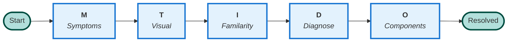

# User-Facing Diagram Standards

**Purpose**: Standards for diagrams shown to technicians in the VSM frontend UI  
**Date**: 2025-01-11

---

## Folder Structure

```
features/diagrams_vsm/
├── user_facing/          ← Simple diagrams for UI display
│   ├── smido_overview.mermaid
│   ├── basic_cycle.mermaid
│   ├── measurement_points.mermaid
│   └── troubleshooting_template.mermaid
│
└── agent_internal/       ← Complex diagrams for agent logic
    ├── smido_main_flowchart.mermaid
    ├── smido_3ps_diagnosis.mermaid
    ├── balance_diagram.mermaid
    └── ...
```

---

## User-Facing Diagram Standards

### Layout

**REQUIRED**: 
- ✅ **LR (Left-to-Right)** or square layout
- ❌ **NO TD (Top-Down)** - too tall, requires scrolling

**Aspect Ratio**:
- **Landscape**: 16:9 or 3:2 (preferred)
- **Square**: 1:1 (acceptable)
- **NOT tall**: Avoid 9:16 or similar

### Complexity

**Maximum**:
- **10-15 nodes** total
- **3-5 decision points** maximum
- **1-2 subgraphs** if needed
- **One clear message** per diagram

### Visual Style

**Colors**:
- **Maximum 4-5 colors** per diagram
- **High contrast**: Text readable on all backgrounds
- **Consistent palette** across all user diagrams:
  - Blue: `#e3f2fd` / `#1976d2` - Main phases
  - Yellow: `#fff9c4` / `#f57f17` - Decisions
  - Green: `#e8f5e9` / `#2e7d32` - Success/OK
  - Red: `#ffebee` / `#c62828` - Problems/Errors
  - Gray: `#f5f5f5` / `#616161` - Neutral/Actions

**Typography**:
- **Sans-serif**: Clean, modern
- **Bold for emphasis**: Phase names, key terms
- **Italic for descriptions**: Secondary info
- **Font size**: Readable at 800px width

**Shapes**:
- **Stadium** `([...])`: Start/End only
- **Rounded rectangle** `(...)`: Main steps/phases
- **Rectangle** `[...]`: Actions/tasks
- **Diamond** `{...}`: Yes/No decisions
- **NO complex shapes**: Keep it simple

### Text Content

**Labels**:
- **Maximum 2-3 words** per node
- **Dutch primary**: Target audience
- **Optional English**: Italic, secondary
- **NO long descriptions**: Use tooltips/metadata instead

**Example**:
- ✅ `M["<b>Melding</b><br/><i>Symptoms</i>"]`
- ❌ `M["M - MELDING<br/>Report/Symptoms<br/>Wat is het probleem?<br/>Collect all information"]`

### Styling

**REQUIRED**:
- ✅ Use `classDef` for reusable styles
- ✅ Consistent stroke widths (2-3px)
- ✅ Clear visual hierarchy
- ❌ NO inline `style` statements

**Example**:
```mermaid
classDef phase fill:#e3f2fd,stroke:#1976d2,stroke-width:3px
classDef decision fill:#fff9c4,stroke:#f57f17,stroke-width:2px
class M,T,I,D,O phase
class Check1,Check2 decision
```

---

## Diagram Categories

### User-Facing (Show in UI)

| Diagram | Purpose | Layout | Complexity |
|---------|---------|--------|------------|
| **SMIDO Overview** | Show 5 main phases | LR | Simple (8 nodes) |
| **Basic Cycle** | Explain refrigeration fundamentals | LR or circular | Simple (4-6 nodes) |
| **Measurement Points** | Where to measure P/T | Square | Simple (6-8 nodes) |
| **Troubleshooting Template** | How to format findings | LR | Simple (3 nodes) |

### Agent-Internal (Not shown to users)

| Diagram | Purpose | Layout | Complexity |
|---------|---------|--------|------------|
| **SMIDO Full Flowchart** | Complete decision tree | TD | Complex (30+ nodes) |
| **4 P's Diagnosis** | Detailed checklist | TD | Complex (20+ nodes) |
| **Balance Diagram** | System relationships | Graph | Complex (15+ nodes) |
| **Pressostat Logic** | Settings adjustment | TD | Complex (12+ nodes) |
| **Frozen Evaporator Example** | Complete case study | TD | Complex (15+ nodes) |
| **Data Integration** | Architecture diagram | TD | Complex (15+ nodes) |

---

## Design Checklist

Before creating/updating a user-facing diagram:

- [ ] Layout is LR (landscape) or square
- [ ] 10-15 nodes maximum
- [ ] 4-5 colors maximum
- [ ] Text is 2-3 words per node
- [ ] Uses `classDef` for styling
- [ ] High contrast for readability
- [ ] One clear message/purpose
- [ ] Fits on screen without scrolling (at 800px width)
- [ ] Professional, clean appearance
- [ ] Renders correctly in Mermaid.js

---

## Example: Good User-Facing Diagram



**Why it's good**:
- Horizontal layout (LR)
- Simple (8 nodes)
- Clear flow
- Minimal text
- Consistent styling
- Professional appearance

---

## Implementation Priority

1. **Create 4 essential user-facing diagrams**:
   - SMIDO Overview (M→T→I→D→O)
   - Basic Refrigeration Cycle
   - Measurement Points
   - Troubleshooting Template

2. **Move existing complex diagrams to agent_internal/**

3. **Update Weaviate metadata** to distinguish user vs agent diagrams

4. **Update agent logic** to show correct diagram type based on context

---

**Next Steps**: 
1. Create folder structure
2. Create first simple user-facing diagram
3. Move complex diagrams
4. Update documentation

