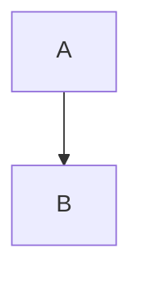

# Elysia Framework Diagrams - Complete Index

## Quick Navigation

### 📚 Start Here
- **[README.md](README.md)** - Overview of documentation structure
- **[COMPREHENSIVE_SUMMARY.md](COMPREHENSIVE_SUMMARY.md)** - Complete technical summary (47 pages)

### 🎯 Learning Path

**Beginner Path** (Understanding the basics):
1. [01_system_overview.mermaid](01_system_overview.mermaid) - See the big picture
2. [02_three_pillars.mermaid](02_three_pillars.mermaid) - Understand core concepts
3. [03_decision_tree_structure.mermaid](03_decision_tree_structure.mermaid) - Learn tree basics
4. [05_tree_lifecycle.mermaid](05_tree_lifecycle.mermaid) - Follow execution flow

**Intermediate Path** (Building with Elysia):
1. [07_tree_class.mermaid](07_tree_class.mermaid) - Main Tree class
2. [10_tool_system.mermaid](10_tool_system.mermaid) - Creating tools
3. [15_dspy_integration.mermaid](15_dspy_integration.mermaid) - LLM integration
4. [20_collection_preprocessing.mermaid](20_collection_preprocessing.mermaid) - Data preparation

**Advanced Path** (Deep understanding):
1. [04_decision_node_execution.mermaid](04_decision_node_execution.mermaid) - Decision logic
2. [06_recursion_and_loops.mermaid](06_recursion_and_loops.mermaid) - Loop control
3. [12_query_tool_detail.mermaid](12_query_tool_detail.mermaid) - Query internals
4. [23_chunk_on_demand.mermaid](23_chunk_on_demand.mermaid) - Advanced features

---

## Complete Diagram List

### High-Level Architecture (01-02)
| File | Description | Key Topics |
|------|-------------|------------|
| [01_system_overview.mermaid](01_system_overview.mermaid) | Complete system architecture | Frontend, Backend, Core Engine, LLM Layer, Data Layer, Preprocessing |
| [02_three_pillars.mermaid](02_three_pillars.mermaid) | Three pillars of Elysia | Decision Trees, Dynamic Display, Data Awareness |

### Decision Tree Architecture (03-06)
| File | Description | Key Topics |
|------|-------------|------------|
| [03_decision_tree_structure.mermaid](03_decision_tree_structure.mermaid) | Tree components and branches | Nodes, Options, Initialization Modes, Tree Construction |
| [04_decision_node_execution.mermaid](04_decision_node_execution.mermaid) | How decisions are made | AssertedModule, LLM Calls, Validation, Retry Logic |
| [05_tree_lifecycle.mermaid](05_tree_lifecycle.mermaid) | From initialization to completion | States, Transitions, Iteration Loop, Completion Criteria |
| [06_recursion_and_loops.mermaid](06_recursion_and_loops.mermaid) | Recursion control | Loop Prevention, Error Handling, Impossible Flag, Limits |

### Core Components (07-09)
| File | Description | Key Topics |
|------|-------------|------------|
| [07_tree_class.mermaid](07_tree_class.mermaid) | Main Tree class structure | Properties, Methods, Relationships, Lifecycle |
| [08_tree_data_objects.mermaid](08_tree_data_objects.mermaid) | TreeData, Environment, Atlas, CollectionData | Structure, Storage, Metadata Format |
| [09_decision_node_class.mermaid](09_decision_node_class.mermaid) | DecisionNode internals | Options, Decision Flow, AssertedModule, Prompts |

### Tool System (10-14)
| File | Description | Key Topics |
|------|-------------|------------|
| [10_tool_system.mermaid](10_tool_system.mermaid) | Tool architecture | Base Class, Built-in Tools, Custom Creation, Lifecycle |
| [11_tool_execution_flow.mermaid](11_tool_execution_flow.mermaid) | Tool execution sequence | Call Flow, Result Handling, Error Propagation |
| [12_query_tool_detail.mermaid](12_query_tool_detail.mermaid) | Query tool deep dive | Query Generation, Execution, Chunking, Display Mapping |
| **13-14** | *(Reserved for Aggregate/Visualize tools)* | - |

### LLM Integration (15-18)
| File | Description | Key Topics |
|------|-------------|------------|
| [15_dspy_integration.mermaid](15_dspy_integration.mermaid) | DSPy framework usage | ElysiaChainOfThought, Signatures, Multi-Model Strategy |
| **16-17** | *(Reserved for CoT/Model Strategy details)* | - |
| [18_feedback_system.mermaid](18_feedback_system.mermaid) | Few-shot learning | Feedback Collection, Storage, Retrieval, Learning Loop |

### Data Management (19-22)
| File | Description | Key Topics |
|------|-------------|------------|
| **19** | *(Reserved for Environment storage)* | - |
| [20_collection_preprocessing.mermaid](20_collection_preprocessing.mermaid) | Collection analysis pipeline | Schema Analysis, LLM Analysis, Display Selection, Metadata |
| **21-22** | *(Reserved for Result objects/Frontend payloads)* | - |

### Advanced Features (23-26)
| File | Description | Key Topics |
|------|-------------|------------|
| [23_chunk_on_demand.mermaid](23_chunk_on_demand.mermaid) | Dynamic document chunking | Criteria, Process, Cross-References, Benefits |
| **24-26** | *(Reserved for Error handling/Training/Conversation mgmt)* | - |

### API and Backend (27-30)
| File | Description | Key Topics |
|------|-------------|------------|
| [27_fastapi_structure.mermaid](27_fastapi_structure.mermaid) | FastAPI architecture | Routes, Lifespan, Dependencies, Services, Static Serving |
| **28-30** | *(Reserved for WebSocket/UserManager/ClientManager)* | - |

### Detailed Flows (31-34)
*(Reserved for complete flow sequences)*

### Integration Points (35-38)
*(Reserved for Weaviate integration, preprocessing pipeline, display system, assertions)*

---

## Diagram Types

### 🔵 Graph Diagrams (graph TB)
- System architecture
- Component relationships
- Data flows
Best for: Understanding structure and connections

### 🟢 Sequence Diagrams (sequenceDiagram)
- Step-by-step execution
- Message passing
- Timing relationships
Best for: Understanding processes and interactions

### 🟡 State Diagrams (stateDiagram-v2)
- State transitions
- Lifecycle management
- Event handling
Best for: Understanding state changes and workflows

### 🟠 Class Diagrams (classDiagram)
- Object structure
- Properties and methods
- Relationships
Best for: Understanding code architecture

---

## How to Use These Diagrams

### For VSM Project Integration

**Step 1: Understand Elysia Fundamentals**
- Read: 01, 02, 03, 05
- Understand: How Elysia organizes decision-making

**Step 2: Learn Tool Creation**
- Read: 10, 11, 12
- Apply: Create VSM-specific tools (compute_worldstate, query_manuals_by_smido)

**Step 3: Data Integration**
- Read: 20, 08
- Apply: Preprocess VSM collections, design metadata structure

**Step 4: Custom Decision Tree**
- Read: 03, 04, 06
- Apply: Design SMIDO-based tree structure

**Step 5: Advanced Features**
- Read: 23, 18, 15
- Apply: Implement chunking for manuals, feedback for troubleshooting patterns

### For Development

**Building a New Tool**:
1. Review: [10_tool_system.mermaid](10_tool_system.mermaid)
2. Study: [11_tool_execution_flow.mermaid](11_tool_execution_flow.mermaid)
3. Reference: [12_query_tool_detail.mermaid](12_query_tool_detail.mermaid) (example)
4. Implement: Custom tool with async generator pattern

**Modifying Tree Structure**:
1. Review: [03_decision_tree_structure.mermaid](03_decision_tree_structure.mermaid)
2. Plan: Branch hierarchy and tool placement
3. Implement: Use Tree.add_branch() and Tree.add_tool()
4. Test: Verify with Tree.view()

**Adding Data Sources**:
1. Review: [20_collection_preprocessing.mermaid](20_collection_preprocessing.mermaid)
2. Prepare: Collection with proper schema
3. Run: preprocess(collection_name)
4. Verify: Check ELYSIA_METADATA__

**Debugging Issues**:
1. Review: [06_recursion_and_loops.mermaid](06_recursion_and_loops.mermaid) - Loop issues
2. Review: [04_decision_node_execution.mermaid](04_decision_node_execution.mermaid) - Decision issues
3. Review: [11_tool_execution_flow.mermaid](11_tool_execution_flow.mermaid) - Tool issues
4. Check: Tree visualization in frontend

---

## Mermaid Rendering

### Online Viewers
- **Mermaid Live Editor**: https://mermaid.live/
- **GitHub**: Automatically renders `.mermaid` files
- **VS Code**: Install "Mermaid Preview" extension

### Local Rendering
```bash
# Install mermaid-cli
npm install -g @mermaid-js/mermaid-cli

# Render to PNG
mmdc -i diagram.mermaid -o diagram.png

# Render to SVG
mmdc -i diagram.mermaid -o diagram.svg
```

### In Documentation
```markdown
# Include in Markdown


# Or render inline

```

---

## Coverage Matrix

| Topic | Covered | Diagram Files |
|-------|---------|---------------|
| **System Overview** | ✅ Complete | 01 |
| **Core Concepts** | ✅ Complete | 02 |
| **Tree Structure** | ✅ Complete | 03, 05, 06 |
| **Decision Logic** | ✅ Complete | 04, 09 |
| **Component Classes** | ✅ Complete | 07, 08 |
| **Tool System** | ✅ Complete | 10, 11, 12 |
| **LLM Integration** | ✅ Complete | 15, 18 |
| **Data Management** | ✅ Complete | 20 |
| **Advanced Features** | ✅ Complete | 23 |
| **API/Backend** | ✅ Complete | 27 |
| **Aggregate Tool** | ⚠️ Reserved | 13 |
| **Visualize Tool** | ⚠️ Reserved | 14 |
| **CoT Details** | ⚠️ Reserved | 16 |
| **Model Strategy** | ⚠️ Reserved | 17 |
| **Environment Storage** | ⚠️ Reserved | 19 |
| **Result Objects** | ⚠️ Reserved | 21 |
| **Frontend Payloads** | ⚠️ Reserved | 22 |
| **Error Handling** | ⚠️ Reserved | 24 |
| **Training Updates** | ⚠️ Reserved | 25 |
| **Conversation Mgmt** | ⚠️ Reserved | 26 |
| **WebSocket** | ⚠️ Reserved | 28 |
| **UserManager** | ⚠️ Reserved | 29 |
| **ClientManager** | ⚠️ Reserved | 30 |
| **Complete Flows** | ⚠️ Reserved | 31-34 |
| **Integration Points** | ⚠️ Reserved | 35-38 |

**Legend**:
- ✅ Complete: Diagram created and documented
- ⚠️ Reserved: Slot reserved for future expansion
- ❌ Not Applicable: Not needed for current scope

---

## Quick Reference

### Key Concepts
- **Tree**: Main orchestrator class
- **DecisionNode**: Decision point in tree
- **Tool**: Executable action
- **TreeData**: Global state container
- **Environment**: Object storage
- **Result**: Tool output
- **Feedback**: Learning mechanism

### Important Files (in codebase)
- `elysia/tree/tree.py` - Main Tree class
- `elysia/tree/objects.py` - TreeData, Environment
- `elysia/tree/util.py` - DecisionNode, helpers
- `elysia/objects.py` - Tool, Result types
- `elysia/tools/retrieval/query.py` - Query tool
- `elysia/preprocessing/collection.py` - preprocess()
- `elysia/api/app.py` - FastAPI app

### Common Patterns
```python
# Create tree
tree = Tree(branch_initialisation="one_branch")

# Add custom tool
@tool(tree=tree, branch_id="base")
async def my_tool(param: str, tree_data: TreeData = None):
    yield Status("Working...")
    yield Result(objects=[{"result": "data"}])

# Run query
response, objects = tree.run("What is Elysia?")

# Preprocess collection
preprocess("MyCollection")
```

---

## Updates & Contributions

### Last Updated
- **Date**: November 11, 2025
- **Version**: Based on Elysia v0.3.0
- **Scope**: Core architecture and main features

### Future Additions
As Elysia evolves, we'll add:
- Additional tool deep-dives (13-14, 16-17)
- Complete flow diagrams (31-34)
- Integration point diagrams (35-38)
- Performance optimization diagrams
- Security and auth diagrams

### Maintenance
These diagrams are maintained alongside the VSM project as reference documentation for understanding and extending the Elysia framework.

---

## Questions & Support

For questions about:
- **Elysia Framework**: GitHub issues, Weaviate community Slack
- **VSM Integration**: Reference COMPREHENSIVE_SUMMARY.md section "Extension Points for VSM Project"
- **Diagram Interpretation**: Check README.md for concepts, or relevant diagram's notes

**Key Resources**:
- 📖 Official Docs: https://weaviate.github.io/elysia/
- 💬 Blog Post: https://weaviate.io/blog/elysia-agentic-rag
- 🎮 Demo: https://elysia.weaviate.io
- 💻 GitHub: https://github.com/weaviate/elysia

---

**Happy Building! 🚀**

