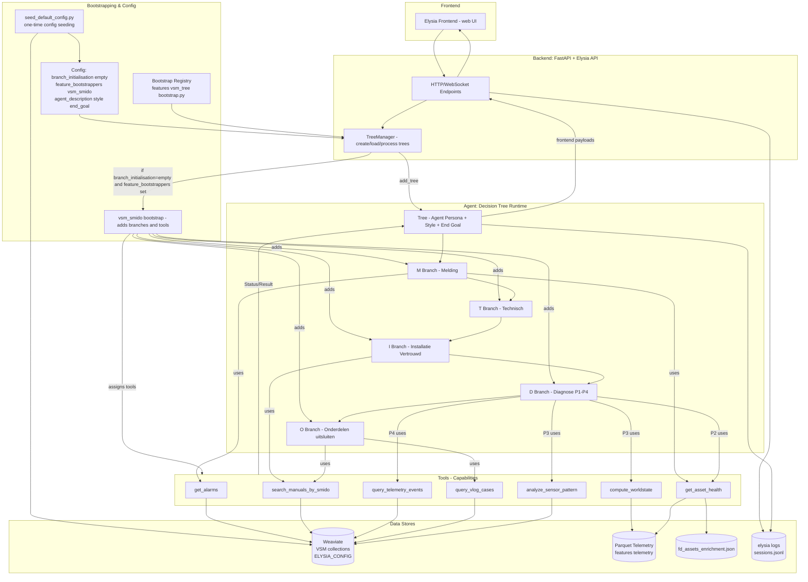

# VSM System Information Flow

This document describes the overall data and control flow for the VSM Demo on Elysia framework.

**Flow Path**: Frontend → API → TreeManager → Tree (Agent) → Branches (SMIDO) → Tools → Data stores → Results back to UI

---

## Visual Diagram



---

## System Components

### 1. Frontend Layer

- **Elysia Frontend**: Web UI for user interaction
  - Provides chat interface
  - Displays agent responses and status updates
  - Sends user messages and receives structured payloads

### 2. Backend: FastAPI + Elysia API

- **HTTP/WebSocket Endpoints**: Entry points for frontend requests
- **TreeManager**: Core orchestrator
  - Creates and loads decision trees
  - Processes user messages
  - Manages tree lifecycle

### 3. Agent: Decision Tree Runtime

The agent operates through a structured decision tree with SMIDO branches:

- **Tree**: Top-level agent with persona, style, and end goal
- **M Branch - Melding**: Symptom collection phase
- **T Branch - Technisch**: Technical inspection phase
- **I Branch - Installatie Vertrouwd**: Familiarity check phase
- **D Branch - Diagnose (P1-P4)**: Diagnosis phase with 4 P's:
  - P1: Power checks
  - P2: Process settings (Procesinstellingen)
  - P3: Process parameters (Procesparameters)
  - P4: Product input (Productinput)
- **O Branch - Onderdelen uitsluiten**: Component isolation phase

### 4. Bootstrapping & Configuration System

The VSM system uses a bootstrap mechanism to dynamically load the SMIDO tree structure:

- **Config**: Contains key settings
  - `branch_initialisation=empty` - Start with empty tree
  - `feature_bootstrappers=vsm_smido` - Load VSM SMIDO bootstrapper
  - `agent_description`, `style`, `end_goal` - Agent persona settings
  
- **Bootstrap Registry**: Registry system in `features/vsm_tree/bootstrap.py`
  - Maintains available bootstrappers
  - Maps feature names to bootstrap functions

- **vsm_smido bootstrap**: The VSM-specific bootstrapper
  - Adds all 5 SMIDO branches (M→T→I→D→O)
  - Assigns 7 custom tools to appropriate branches
  - Automatically executed when tree is created

- **seed_default_config.py**: One-time configuration seeding
  - Pre-populates Weaviate with default config
  - Enables frontend to skip manual configuration
  - Seeds VSM-specific settings

### 5. Tools (Agent Capabilities)

The agent has access to 7 custom tools:

1. **get_alarms**: Query active alarms and historical alarm events
2. **get_asset_health**: Compare WorldState (W) vs Context (C) - balance check
3. **compute_worldstate**: Compute 60+ features from parquet telemetry data
4. **analyze_sensor_pattern**: Pattern matching against reference snapshots
5. **search_manuals_by_smido**: Search manuals and diagrams filtered by SMIDO phase
6. **query_telemetry_events**: Query historical telemetry events from Weaviate
7. **query_vlog_cases**: Search video case studies for similar problems

### 6. Data Stores

#### Weaviate (Vector Database)
- **VSM Collections**:
  - `VSM_ManualSections`: 167 manual sections (SMIDO-classified)
  - `VSM_Diagram`: 9 technical diagrams
  - `VSM_TelemetryEvent`: 12 historical "uit balans" events
  - `VSM_VlogCase`: 5 video case studies
  - `VSM_VlogClip`: 15 video clips
  - `VSM_WorldStateSnapshot`: 13 reference patterns (synthetic)
- **ELYSIA_CONFIG**: Default configuration for frontend

#### Parquet Files
- **Telemetry data**: 785K rows of sensor readings
- Located in `features/telemetry/`
- Read directly by `compute_worldstate` tool

#### JSON Files
- **fd_assets_enrichment.json**: Commissioning data (Context C)
- Contains design parameters and historical baselines

#### Log Files
- **elysia/logs/sessions.jsonl**: All session logs (JSONL format)
- **elysia/logs/sessions/**: Individual session files by user/conversation

---

## Data Flow

### 1. Initialization Flow

```
User → Frontend
  → API Endpoints
    → TreeManager.add_tree()
      → Load Config from Weaviate
      → Check: branch_initialisation="empty" and feature_bootstrappers set?
        → YES: Apply vsm_smido bootstrap
          → Add M, T, I, D, O branches
          → Assign tools to branches
        → Create Tree with agent persona
```

### 2. Configuration Seeding Flow (One-time)

```
seed_default_config.py
  → Write Config to Weaviate (ELYSIA_CONFIG)
  → Set feature_bootstrappers=["vsm_smido"]
  → Set agent_description, style, end_goal
```

### 3. Conversation Flow

```
User message → Frontend
  → API Endpoints
    → TreeManager.process()
      → Tree decides current branch
        → Branch selects appropriate tool(s)
          → Tool accesses data stores
            → Weaviate (for semantic search)
            → Parquet (for time-series analysis)
            → JSON (for commissioning data)
          → Tool returns Status/Result
        → Tree generates response
      → Response sent to Frontend
    → Log to sessions.jsonl and session files
  → Frontend displays response
```

---

## Branch → Tool Mapping

### M Branch (Melding - Symptom Collection)
- Uses: `get_alarms`, `get_asset_health`
- Purpose: Understand current state, check for active alarms, assess urgency

### T Branch (Technisch - Technical Inspection)
- Uses: `get_asset_health`
- Purpose: Visual/audio inspection guidance, quick checks

### I Branch (Installatie Vertrouwd - Familiarity Check)
- Uses: `search_manuals_by_smido`
- Purpose: Access schemas, design parameters, system fundamentals

### D Branch (Diagnose - 4 P's)
- **P2 (Procesinstellingen - Settings)**: Uses `get_asset_health`
- **P3 (Procesparameters - Measurements)**: Uses `compute_worldstate`, `analyze_sensor_pattern`
- **P4 (Productinput - External Conditions)**: Uses `query_telemetry_events`
- Purpose: Systematic diagnosis through 4 dimensions

### O Branch (Onderdelen uitsluiten - Component Isolation)
- Uses: `query_vlog_cases`, `search_manuals_by_smido`
- Purpose: Learn from similar cases, find repair procedures

---

## Tool → Data Access Mapping

### Tools querying Weaviate:
- `get_alarms` → VSM_TelemetryEvent
- `search_manuals_by_smido` → VSM_ManualSections, VSM_Diagram
- `query_telemetry_events` → VSM_TelemetryEvent
- `query_vlog_cases` → VSM_VlogCase, VSM_VlogClip
- `analyze_sensor_pattern` → VSM_WorldStateSnapshot

### Tools reading Parquet:
- `compute_worldstate` → Parquet telemetry files
- `get_asset_health` → Parquet telemetry files (for current W)

### Tools reading JSON:
- `get_asset_health` → fd_assets_enrichment.json (for Context C)

---

## Key Design Patterns

### 1. Bootstrap Pattern
**Why**: Allows dynamic loading of SMIDO tree without hardcoding into Elysia core framework.

**How**:
- Config specifies `feature_bootstrappers: ["vsm_smido"]`
- TreeManager checks config when creating tree with `branch_initialisation="empty"`
- Automatically applies registered bootstrappers
- Result: Full SMIDO tree with tools ready to use

### 2. Hybrid Storage Strategy
**Why**: Optimize for different data access patterns.

**Pattern**:
- **Weaviate**: Semantic search (manuals, cases, events)
- **Parquet**: Time-series analysis (785K sensor rows)
- **JSON**: Static reference data (commissioning parameters)

### 3. WorldState (W) vs Context (C) Comparison
**Why**: Detect "uit balans" (out of balance) vs actual component defects.

**Pattern**:
- Compute W (current state) from parquet
- Load C (design parameters) from JSON
- Compare W vs C to identify deviations
- Diagnose: System operating outside design parameters vs broken component

### 4. Session Logging
**Why**: Track all conversations for analysis and debugging.

**Pattern**:
- Every user message triggers logging
- Stores: user_id, conversation_id, timestamp, messages, tool calls
- Dual format: JSONL for streaming, JSON files for individual sessions

---

## Frontend Configuration Skip

**Problem**: Users opening frontend need to manually configure models, Weaviate, etc.

**Solution**: `seed_default_config.py` pre-populates ELYSIA_CONFIG with:
- Model settings (gpt-4.1, gemini-2.5-pro)
- Weaviate connection
- VSM agent prompts and SMIDO tree structure
- `branch_initialisation="empty"` + `feature_bootstrappers=["vsm_smido"]`

**Result**: Users open frontend → immediately ready to chat → SMIDO tree auto-loaded

---

## Documentation References

- **Bootstrap System**: `features/vsm_tree/bootstrap.py`
- **SMIDO Tree**: `features/vsm_tree/smido_tree.py`
- **Custom Tools**: `elysia/api/custom_tools.py`
- **Config Seeding**: `scripts/seed_default_config.py`
- **Session Logging**: `elysia/api/utils/session_logger.py`
- **TreeManager**: `elysia/api/services/tree.py`

---

## Mermaid Diagram

For a visual representation of this flow, see: `system_info_flow.mermaid`

